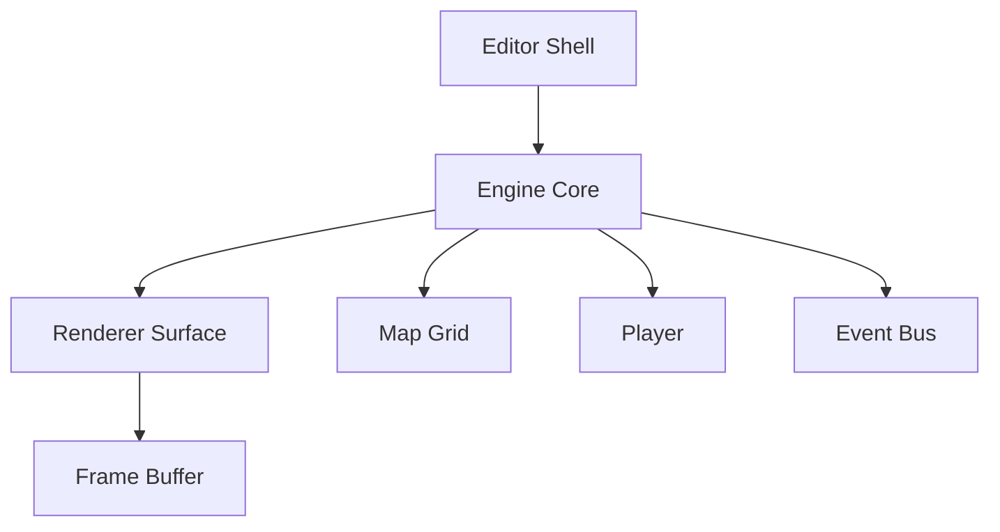

# Engine Core API Surface

This document describes the API surface exposed by the engine-core to renderers, editors, and tooling. It reflects the TypeScript interfaces and classes implemented in scratch/shared/src/engine.

Table of contents
- Overview
- Core types
- Engine lifecycle
- Renderer interface
- Event bus (concept)
- Editor integration contracts (summary)
- Example interactions
- Environment and debugging
- Troubleshooting
- Cross-references

## Overview
The engine core is designed to be pluggable: you can swap the rendering surface without changing the core lifecycle. The core manages a map grid, a player, and a renderer instance. The code surface is intentionally small and stable to facilitate testing and hot-swapping renderers.

## Core types
- MapGrid: 2D array of numbers. 0 = empty cell, 1+ = wall or obstacle
- Vec2: { x: number; y: number }
- Player: { pos: Vec2; dir: Vec2; plane: Vec2 }

From scratch/shared/src/engine/types.ts:
```ts
export interface Vec2 { x: number; y: number; }
export interface Player { pos: Vec2; dir: Vec2; plane: Vec2; }
type MapRow = number[];
export type MapGrid = MapRow[];
export interface RenderOptions { fov?: number; }
```

## Engine lifecycle
- Engine.init(map: MapGrid, player: Player): void — initialize engine state with world data
- Engine.setRenderer(r: Renderer): void — plug in a Renderer implementation
- Engine.start(): void — begin the render loop (UI/browser-driven loop via requestAnimationFrame)
- Engine.stop(): void — stop the render loop
- Engine.renderFrame(): number[] — query the current renderer for a frame bitmap representation (for debugging or non-UI tests)

TypeScript outline (from scratch/shared/src/engine/engine.ts):
```ts
import { MapGrid, Player } from './types';
import { Renderer } from './renderer';

export class Engine {
  private map: MapGrid | null = null;
  private player: Player | null = null;
  private renderer: Renderer | null = null;
  private lastTs: number = 0;
  private running: boolean = false;

  public setRenderer(r: Renderer) { this.renderer = r; }
  public init(map: MapGrid, player: Player) { this.map = map; this.player = player; }
  public start() { /* simplified loop using requestAnimationFrame */ }
  public stop() { this.running = false; }
  public renderFrame(): number[] {
    if (!this.renderer) throw new Error('Renderer not set');
    return this.renderer.renderFrame();
  }
}
```

## Renderer interface
- Renderer.init(map: MapGrid, player: Player): void
- Renderer.renderFrame(): number[]

Concrete implementation example: scratch/shared/src/engine/renderer.ts defines the interface, and scratch/shared/src/engine/renderer_raycaster.ts provides a working RaycastRenderer that computes a 2.5D frame into a 1D buffer of grayscale shades.

Example usage:
```ts
import { Engine } from './engine';
import { RaycastRenderer } from './renderer_raycaster';
import { MapGrid, Player } from './types';

const map: MapGrid = [
  [1,1,1,1,1],
  [1,0,0,0,1],
  [1,0,1,0,1],
  [1,0,0,0,1],
  [1,1,1,1,1],
];

const player: Player = { pos: { x: 2.5, y: 2.5 }, dir: { x: -1, y: 0 }, plane: { x: 0, y: 0.66 } };

const engine = new Engine();
const renderer = new RaycastRenderer();
renderer.init(map, player);
engine.setRenderer(renderer);
engine.init(map, player);
engine.start();
```

## Event bus (concept)
The engine may expose a simple event bus to decouple subsystems (renderer, editor, physics) via on/emit. A minimal concept is shown here for guidance; the actual implementation may live in scratch/shared/src/engine/event_bus.ts if/when introduced.

```ts
export type EventHandler = (...args: any[]) => void;
export class EventBus {
  private handlers = new Map<string, EventHandler[]>();
  on(event: string, cb: EventHandler) {
    this.handlers.compute(event, (_k, v) => [...(v ?? []), cb]);
  }
  off(event: string, cb: EventHandler) {
    const list = this.handlers.get(event) ?? [];
    this.handlers.set(event, list.filter((h) => h !== cb));
  }
  emit(event: string, ...args: any[]) {
    this.handlers.get(event)?.forEach((cb) => cb(...args));
  }
}
```

Notes:
- The actual code in this repo currently places Editor integration under scratch/shared/src/engine/ui/editorShell and renderer implementations under scratch/shared/src/engine/renderer* files.
- The event bus is a suggested pattern to connect subsystems as the architecture grows.

## Editor integration contracts (summary)
Editor contracts define how editor actions map to engine state, typically serialized as JSON. See EDITOR_CONTRACTS.md for full payload shapes and examples.

## Example interactions
- Quick-start: create a MapGrid and a Player (types.ts), choose a renderer (renderer_raycaster.ts), then:
```ts
const engine = new Engine();
const renderer = new RaycastRenderer();
renderer.init(map, player);
engine.setRenderer(renderer);
engine.init(map, player);
engine.start();
```

## Environment and debugging
- ENGINE_DEBUG: enable verbose logs from engine components
- RENDERER_QUALITY: hint to renderer about performance/quality

"ENGINE_DEBUG=true" can be checked in your runtime to toggle console logs.

## Troubleshooting
- If start throws "Renderer not set", ensure you called setRenderer before start and that the renderer implements the Renderer interface.
- If renderFrame returns an empty frame, verify the map and player are non-null and initialized.

## Cross-references
- EDITOR_CONTRACTS.md for editor payload contracts
- scratch/shared/src/ARCH_PATTERNS.md for architectural guidance
- README_DEVELOPERS.md for developer-oriented diagrams

## Architecture diagrams


