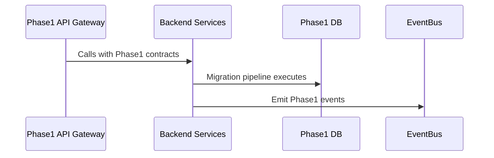

# Phase 1 Architecture Overview

This document describes the Phase 1 consolidation architecture, focusing on contract pruning, data model stabilization, and the interaction surface between API Gateway, backend services, and the EventBus.

## System Diagram (Mermaid)

## Key Components
- Phase1 API Gateway: Routes, auth, and contract validation against phase1.yaml
- Phase1 Services: Consume Phase 1 contracts and migrate state
- Phase1 DB: Phase 1 schema and migrations
- Phase1 EventBus: Publish/Subscribe for Phase 1 events

## Data Flows
- Ingest: API Gateway validates requests against Phase1 contracts, forwards to services
- Migrate: Services apply Phase1 migrations to DB
- Notify: Services emit Phase1 events to EventBus

## Migration Strategy
- Backward compatibility via feature flags
- Rollout with staged gates and monitoring

## OpenAPI and Contracts
- Phase 1: phase1.yaml and phase1.yaml openapi definitions are the source of truth

## Environment Variables
- PHASE1_API_BASE
- PHASE1_MIGRATIONS_DIR
- PHASE1_CONTRACTS_PATH
- PHASE1_DB_URL
- PHASE1_LOG_LEVEL
- PHASE1_FEATURE_FLAGS

