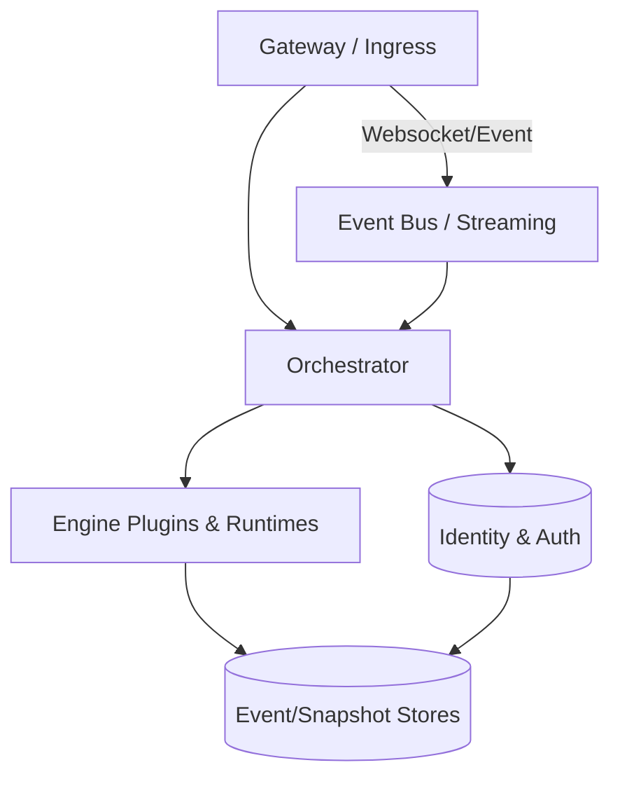
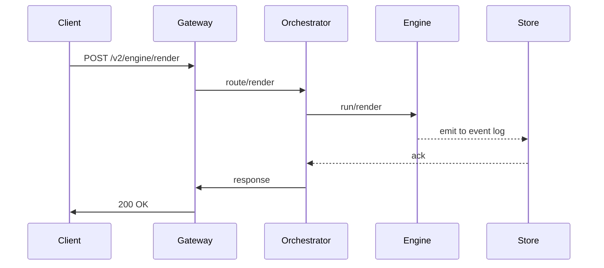

# Phase 2 Architecture (Skeleton)

Table of Contents
- [Overview](#overview)
- [OpenAPI surface alignment](#openapi-surface-alignment)
- [High-Level Architecture](#high-level-architecture)
- [Component catalog](#component-catalog)
- [Data model and schemas](#data-model-and-schemas)
- [Data flow diagrams](#data-flow-diagrams)
- [Security and identities](#security-and-identities)
- [Deployment considerations](#deployment-considerations)
- [Backward compatibility and migrations](#backward-compatibility-and-migrations)
- [Observability](#observability)
- [Glossary](#glossary)
- [Troubleshooting](#troubleshooting)
- [References](#references)

---

## Overview
This file provides the skeleton for Phase 2 architecture. It maps the OpenAPI surface (Phase 2: v2) to the runtime components and data flows. The canonical API contract is available at:

- Phase 2 OpenAPI contract: `shared/openapi/phase2.yaml`
- Phase 1 OpenAPI contract: `shared/openapi/phase1.yaml` (for compatibility shims)

> Note: This skeleton is designed to be fleshed out with concrete diagrams, component responsibilities, and interaction protocols.

---

## OpenAPI surface alignment
- List of endpoints exposed in Phase 2: v2 under base path `/v2`.
- Authentication/authorization mechanisms aligned with the OpenAPI spec.
- Mapping of each endpoint to its responsible service (gateway, orchestrator, engine, etc.).
- Error handling and standard response envelopes in alignment with `phase2.yaml`.
- Cross-references to `shared/openapi/phase2.yaml` for request/response schemas.

Suggested action: extract the endpoints table from `phase2.yaml` and use it here as a living reference.

---

## High-Level Architecture

Mermaid diagram illustrating the main system components and their interactions.

Notes:
- Gateway handles routing, auth, and request shaping.
- Orchestrator coordinates plugin engines and lifecycle.
- Engine plugins execute tasks and emit events.
- Data stores capture events, state, and results.
- Event bus provides streaming and pub/sub semantics.

---

## Component catalog
- Gateway / Ingress
- Orchestrator
- Engine Plugins (Rendering, Analysis, etc.)
- Event Bus / Streaming Layer
- Data Stores (Frame buffers, State, Event logs)
- Identity & Access Management
- Observability and Telemetry

For each component, add a sub-section describing responsibilities, interfaces, and health checks.

---

## Data model and schemas
- Core schemas referenced by Phase 2:
  - `Phase2Frame`, `Phase2Event`, `Phase2Plan` (placeholders; will map to `phase2.yaml`)
- Backward-compatibility considerations with Phase 1 schemas.

Define the data flow between schemas and components.

---

## Data flow diagrams
- End-to-end data flow from ingress to results, including error paths.
- Include sequence diagrams in Mermaid for common operations (e.g., render request, plugin execution, result emission).

Example:

---

## Security and identities
- Authentication: OAuth2 / JWT, etc.
- Authorization: role-based access control (RBAC) for endpoints.
- Credential storage and rotation considerations.
- Audit logging requirements.

---

## Deployment considerations
- Environments (dev/stage/prod), resource sizing, and scaling policies.
- Canary and feature flags integration with Rollout plan.
- Logging, metrics, and tracing strategies.
- Data retention and backup strategies.

---

## Backward compatibility and migrations
- How Phase 2 changes affect Phase 1 consumers.
- Migration paths, deprecation timelines, and shim layers.
- Versioned API surface and client compatibility guidelines.

---

## Observability
- Metrics to surface per component.
- Distributed tracing approach.
- Health checks and readiness probes.
- Log aggregation and log formats.

---

## Glossary
- Phase 2, Phase 1, Gateway, Orchestrator, Engine, Shim, Canary, etc.

---

## Troubleshooting
- Common failure modes and remediation steps.
- Links to runbooks.

---

## References
- Phase 2 OpenAPI contract: `shared/openapi/phase2.yaml`.
- Phase 1 contract: `shared/openapi/phase1.yaml`.
- Master Plan: see cross-links in Phase 2 Readme skeleton.
