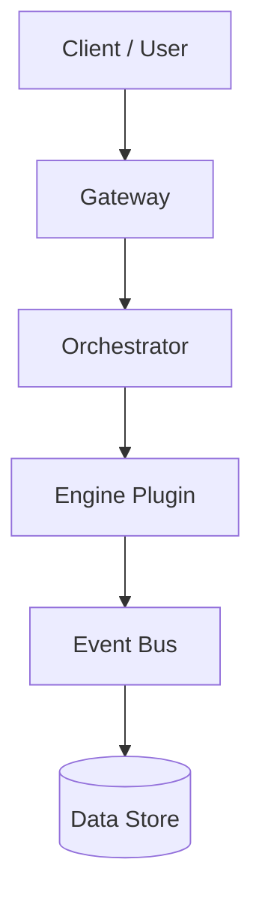

# Phase 2 Rollout Strategy

## Table of Contents
- [Overview](#overview)
- [Rollout Model](#rollout-model)
- [Phases & Milestones](#phases--milestones)
- [Roles & Responsibilities](#roles--responsibilities)
- [Risks & Mitigations](#risks--mitigations)
- [Rollback & Incident Response](#rollback--incident-response)
- [Health & Observability](#health--observability)
- [Communications](#communications)
- [Diagrams](#diagrams)
- [Cross-References](#cross-references)

## Overview

Phase 2 rollout employs a staged approach with canary deployments, feature flags, and compatibility shims to mitigate risk while transitioning from Phase 1 to Phase 2 surfacing under /v2. This skeleton aligns with the canonical OpenAPI contract at shared/openapi/phase2.yaml and the master plan for Phase 1 compatibility shims.

## Rollout Model

- Canary deployments to a small subset of users/environments
- Feature flags to enable/disable new capabilities per user/group
- Shims for Phase 1 clients to preserve backward compatibility where needed

## Phases & Milestones

1. Internal Lab (Phase 2 Alpha)
   - Validate end-to-end flows against OpenAPI surface
   - Security and resilience checks
   - KPIs: error rate < 0.1%, latency < 300ms
2. Staging / Beta
   - Broader telemetry, synthetic data, load testing
   - Compatibility checks with Phase 1 clients (shim coverage)
3. Global Production
   - Full traffic exposure with canary controls
   - Operational readiness reviews

### Milestones
- M0: OpenAPI surface canonical contract in place
- M1: Internal Lab green all critical paths
- M2: Staging green with canary rollouts
- M3: Global rollout complete

## Roles & Responsibilities
- Product: define rollout criteria and feature flags
- Platform/Infra: maintain canary tooling and monitors
- Security: assess exposure and key rotation
- SRE: incident response and runbooks

## Risks & Mitigations
- Risk: feature flag leakage causing partial exposure
  - Mitigation: feature flags gated behind strict access
- Risk: shim drift with Phase 1 clients
  - Mitigation: automated tests linking Phase 1 and Phase 2 surface
- Risk: elevated latency during rollouts
  - Mitigation: autoscaling and QoS policies

## Rollback & Incident Response
- Trigger conditions for rollback (latency, error spike, failed health checks)
- Rollback steps and communication plan
- Post-incident review template

## Health & Observability
- Metrics: p95 latency, error rate, throughput
- Tracing: distributed traces across gateways and orchestrator
- Logs: structured logging with correlation IDs

## Communications
- Stakeholders: engineering, support, customer communications
- Status dashboards and incident channels

## Diagrams

## Cross-References
- OpenAPI: shared/openapi/phase2.yaml
- Architecture: phase2_architecture.md
- Documentation Master Plan: master_plan.md
