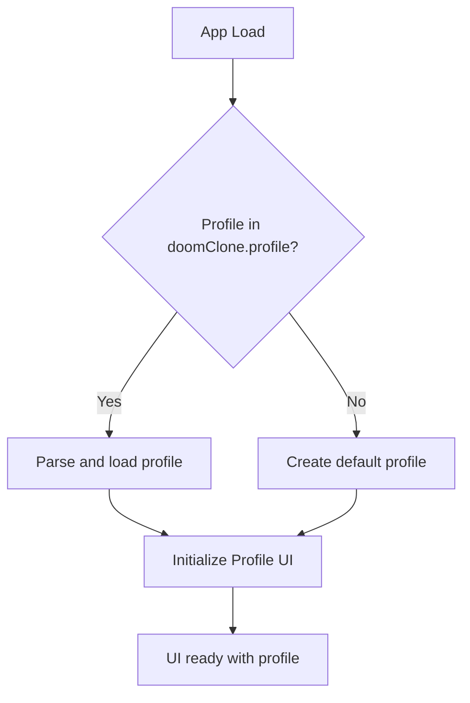

# Local Doom Clone: Profile UI - User Guide

Table of Contents
- Overview
- Storage keys and data model
- Bootstrapping flow
- Core UI files
- How to test locally
- Environment variables
- Troubleshooting
- Mermaid diagrams
- Cross-links
- File references

## Overview
This guide documents the local Doom Clone profile UI used to bootstrap, display, and persist a player profile in the browser. It covers the storage key, data shape, bootstrapping behavior, and how to verify the UI locally without a backend.


## Storage keys and data model
- Storage key: doomClone.profile
- Data shape (JSON)
  - name: string
  - avatar: string (asset file name or URL)
  - level: number
  - health: number
  - score: number
  - inventory: array of strings or objects
  - lastSaved: string (ISO 8601 timestamp)

Example stored object:
```json
{
  "name": "PlayerOne",
  "avatar": "hero.png",
  "level": 3,
  "health": 78,
  "score": 1200,
  "inventory": ["sword","potion"],
  "lastSaved": "2025-01-15T14:25:00.000Z"
}
```


## Bootstrapping flow
1. App loads and executes doomBootstrapping.js.
2. It reads the storage key doomClone.profile from localStorage.
3. If a profile exists, it parses and loads it into the UI state; otherwise, it creates a default profile.
4. The ProfilePanel UI renders using the loaded profile and binds Save/Load actions to localStorage.
5. If the profile is updated, changes are persisted via saveProfile to the same storage key.

Mermaid diagram:



## Core UI files (local)
- profile.js: core data model helpers and persistence utilities.
- ProfilePanel.jsx: React component that renders profile fields (name, avatar, level, health, score, inventory) and exposes Save/Load actions.
- doomBootstrapping.js: bootstrap logic that initializes the UI on startup, reads/creates the profile, and mounts the UI.

Code sample: basic persistence helpers (JavaScript)
```js
// Local persistence helpers (CRA-ready)
export const STORAGE_KEY = (process.env.REACT_APP_DOOM_CLONE_PROFILE_KEY) || 'doomClone.profile';

export const DEFAULT_PROFILE = {
  name: 'Player',
  avatar: 'default.png',
  level: 1,
  health: 100,
  score: 0,
  inventory: [],
  lastSaved: new Date().toISOString()
};

export function loadProfile() {
  const raw = localStorage.getItem(STORAGE_KEY);
  if (!raw) return DEFAULT_PROFILE;
  try {
    return JSON.parse(raw);
  } catch {
    return DEFAULT_PROFILE;
  }
}

export function saveProfile(p) {
  localStorage.setItem(STORAGE_KEY, JSON.stringify(p));
}
```


## How to test locally
Prerequisites:
- Node.js and npm installed
- A local checkout of the Doom Clone repository

Steps
1. Install dependencies and start the UI kit or dev server (CRA/Vite, depending on setup):
```bash
# from scratch/shared
cd scratch/shared
npm install
npm start
```
2. Open the app in your browser (http://localhost:3000 or configured port).
3. Bootstrapping with a missing profile:
- Clear localStorage in your browser and refresh. A default profile should be created and rendered.
4. Save a profile:
- Change name/avatar/level/health/score and trigger a save (e.g., via a Save button or autosave). The profile should persist to localStorage.
5. Auto-load on refresh:
- Reload the page and verify the profile data is restored from doomClone.profile.
6. Corrupt or missing data:
- If localStorage contains invalid JSON, the bootstrap should fall back to DEFAULT_PROFILE and continue.

Manual testing tips:
- Use browser devtools -> Application -> Local Storage to inspect doomClone.profile.
- Verify timestamps are ISO 8601.

Minimal automated smoke test (in-browser):
- Create a new profile, save, refresh, confirm profile persists.

## Environment variables
- For CRA-based apps: use REACT_APP_DOOM_CLONE_PROFILE_KEY to override the storage key. Example:
```bash
# .env.local
REACT_APP_DOOM_CLONE_PROFILE_KEY=doomClone.profile.dev
```
- In runtime, the app should fall back to 'doomClone.profile' if the env var is not provided.

## Troubleshooting
- localStorage not available (e.g., private mode): the UI should gracefully fallback to in-memory storage with a warning in console.
- Privacy blockers or extensions that clear localStorage can reset profile data.
- If the bootstrapping flow fails, check console for JSON parse errors when reading the profile.

## Diagrams
- Mermaid bootstrapping flow (inline above) shows the high-level start sequence.

## Cross-links
- API contracts for users (frontend contracts) – scratch/shared/docs/api_contracts/users_api_contract.md
- Wireframes and design notes – scratch/shared/docs/Wireframes.md
- Main README and QA docs – scratch/shared/README.md

## File references (quick navigation)
- doomBootstrapping.js
- profile.js
- ProfilePanel.jsx

